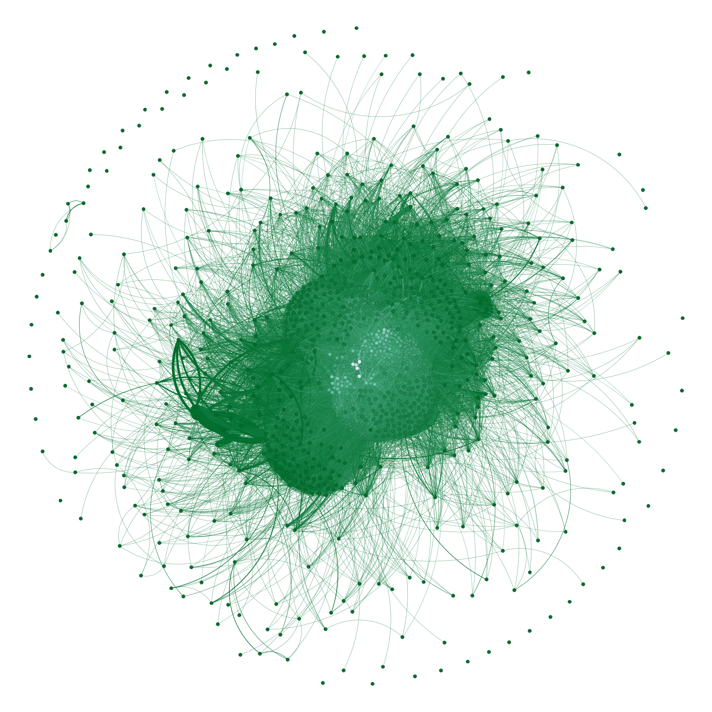

# A graph analysis of collaborations in Python open source community using GitHub

This is the project done by [Enrico Zimuel](https://github.com/ezimuel/) for the course Graph Algorithms
of the Prof. [Stefano Guarino](https://www.iac.cnr.it/personale/stefano-guarino) in the [Master Data Analytics](https://master-data-analytics.it/) postgraduated course at the University of Roma Tre (Italy).

The goal is to study the collaborations between Python open source projects using the
data stored in github.com.

## Configure the Github API token

We used the Github REST API and GraphQL API for retrieving all the information.
That means you need to use an API token provided by Github. You can create a new access token
from [this page](https://github.com/settings/tokens).

When you have the access token, you need to store it in the `GITHUB_ACCESS_TOKEN`
env variable, as follows:

```bash
export GITHUB_TOKEN="insert here the access token"
```

## Virtual environment and dependencies

The first time you need to install the dependencies, we suggest to use a [virtual environment](https://docs.python.org/3/library/venv.html)
using the following commands:

```bash
python3 -m venv env
```

This will install a virtual environment, you need to do this only the first time.
Then, you can activate the virtual env as follows:

```bash
source env/bin/activate
```

Then you can install the dependencies using `pip`, as follows:

```bash
pip install -r requirements.txt
```

You can deactivate the virtual enviroment with following command:

```bash
deactivate
```

## Extract the repository from Github

We extracted the top 1000 Python repositories with more than 5k stars using GraphQL.

To extract these repository you need to execute the `repositories.py` script, as follows:

```bash
python repositories.py
```

This will create a [data/repositories.json](data/repositories.json) file.

## Extract the contributors for each repository

For each repository we need to extract the top 300 contributors.
This is done using the `contributors.py` script, running the following command:

```bash
python contributors.py
```

This command will create 1000 csv files in the `data`` folder with the top 300
contributors for each repository.

## Create the graph model

Finally, we have all the informations for creating the graph model.

In our model a node is a repository and an edge is the connection between repositories.
Two repository are connected with a weight edge if there is at least one common contributor.
The weight of the edge is the number of common contributors.

We used [igraph](data/repositories.json) for creating this model, reading all the repositories
and providing the intersection of the contributors.

You can create the graph model using the following command:

```bash
python build_graph.py
```

The model is generated and stored in the file [network.graphml](network.graphml) using the
[GraphML](http://graphml.graphdrawing.org/) format.

This file contains a graph with 1,000 nodes and 104,148 edges.

Below is reported a visualization of the graph model done with [Gephi](https://gephi.org/) software.




## The analysis of the model

The graph model has been analyzed using the jupyter file [analysis.ipynb].

## Copyright

The author of this software is [Enrico Zimuel](https://github.com/ezimuel/).

This software is released under the [MIT](/LICENSE) license.